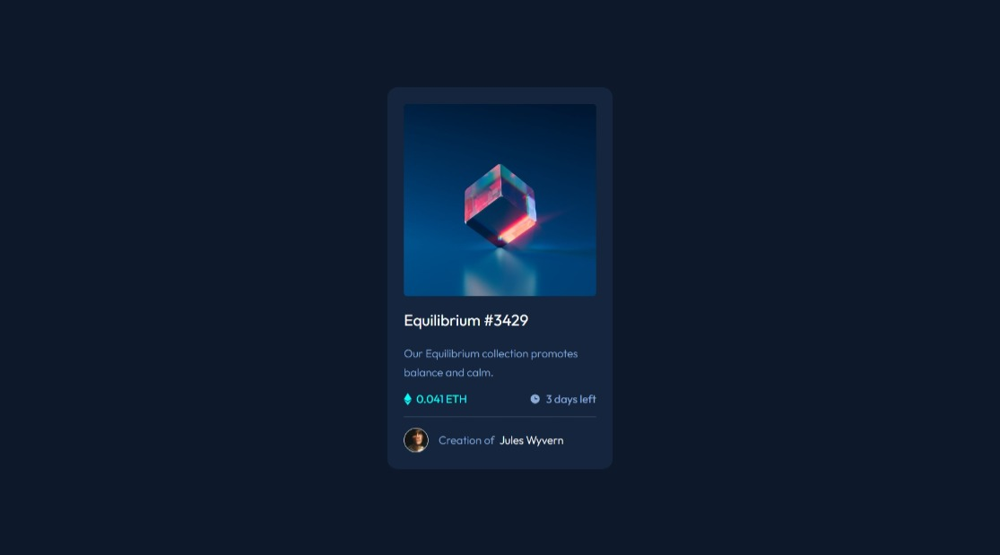
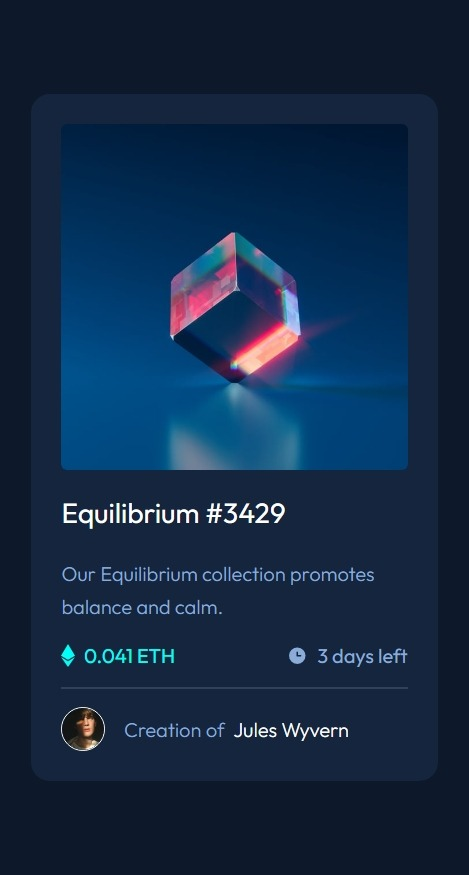

# Frontend Mentor - NFT preview card component solution

This is a solution to the [NFT preview card component challenge on Frontend Mentor](https://www.frontendmentor.io/challenges/nft-preview-card-component-SbdUL_w0U).

## Screenshot

### Desktop Mode


### Mobile Mode


## Links
- Live Site URL: [nft-preview-card-mh.netlify.app](https://nft-preview-card-mh.netlify.app/)

## Usage

```bash
  git clone https://github.com/MrMohammedMath/interactive-rating-component

  cd interactive-rating-component

  npm install
```

- for running dev server

```bash
npm run start
```

- for build & review

```bash
npm run build && npm run preview
```

## My process

### Built with

- Semantic HTML5 markup
- Flexbox
- Mobile-first workflow
- [SCSS](https://sass-lang.com/s) - Superset of CSS
- [csstyle](https://www.csstyle.io/)
- [React](https://reactjs.org/) - JS library

## Author

- Frontend Mentor - [@Mohammed Hassan](https://www.frontendmentor.io/profile/MrMohammedMath)

- linkedin [@Mohammed Hassan](https://www.linkedin.com/in/mr-mohammed-hassan/)

## Acknowledgments
- Inspriation by [Frontend Mentor](https://www.frontendmentor.io/home)